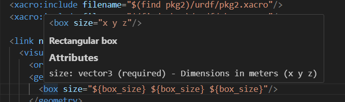

# IntelliSense Features

The URDF Editor provides comprehensive IntelliSense support for URDF, Xacro, and OpenSCAD files, making navigation and editing faster and more intuitive.

## Go to Definition (F12)

Press **F12** or **Ctrl+Click** on any symbol to jump to its definition.

### URDF/Xacro Navigation

#### Links
```xml
<link name="base_link">
  <!-- F12 on "base_link" jumps here -->
  <visual>...</visual>
</link>

<joint name="wheel_joint" type="revolute">
  <parent link="base_link"/>  <!-- F12 on "base_link" jumps to definition above -->
  <child link="wheel_link"/>
</joint>
```

#### Joints
```xml
<joint name="arm_joint" type="revolute">
  <!-- F12 on "arm_joint" jumps here -->
  <parent link="base_link"/>
  <child link="arm_link"/>
</joint>

<mimic joint="arm_joint" multiplier="1.0"/>  <!-- F12 jumps to joint definition -->
```

#### Xacro Macros
```xml
<xacro:macro name="wheel" params="prefix radius">
  <!-- F12 on "wheel" macro name jumps here -->
  <link name="${prefix}_wheel">...</link>
</xacro:macro>

<xacro:wheel prefix="left" radius="0.1"/>  <!-- F12 on "wheel" jumps to macro -->
```

#### Xacro Properties
```xml
<xacro:property name="wheel_radius" value="0.1"/>
<!-- F12 on property name jumps here -->

<cylinder radius="${wheel_radius}" length="0.05"/>  <!-- F12 on property reference -->
```

#### File References
```xml
<!-- F12 opens the referenced file -->
<xacro:include filename="$(find robot_description)/urdf/common.xacro"/>
<mesh filename="package://robot_description/meshes/base.stl"/>
```

**Package Resolution:**
- Automatically resolves `package://` URIs
- Searches workspace and configured package paths
- Falls back to ROS distro packages if not found locally

### OpenSCAD Navigation

#### Modules
```openscad
// F12 on "servo_mount" jumps here
module servo_mount(width, height, depth) {
  difference() {
    cube([width, height, depth]);
    // mounting holes...
  }
}

// F12 on "servo_mount" jumps to definition
servo_mount(40, 20, 10);
```

#### Functions
```openscad
// F12 on "calculate_gear_ratio" jumps here
function calculate_gear_ratio(teeth_driver, teeth_driven) = 
  teeth_driven / teeth_driver;

// F12 on function call jumps to definition
ratio = calculate_gear_ratio(10, 40);
```

#### Cross-File Resolution
```openscad
// In common.scad:
module rounded_box(size, radius) { ... }

// In robot_part.scad:
include <common.scad>
rounded_box([50, 30, 20], 2);  // F12 jumps to common.scad
```

**Include Resolution:**
- Resolves `include <>` and `use <>` statements
- Searches current directory first
- Then checks configured library paths
- Works with workspace-relative paths

## Hover Documentation

Hover over any element to see detailed documentation with parameters and types.

### URDF/Xacro Elements

Hover over built-in elements like `origin`, `link`, `joint`, etc.:

```xml
<box size="${box_size} ${box_size} ${box_size}"/>
```

**Hover shows:**


**Position and orientation (xyz in meters, rpy in radians)**

### Attributes
```
xyz: vector3 (default: "0 0 0") - Position in meters
rpy: vector3 (default: "0 0 0") - Orientation in radians
```

### User-Defined Elements

For xacro macros and properties in your files:

```xml
<xacro:macro name="robot_arm" params="length radius">
  <!-- Creates a robot arm segment -->
  <link name="arm_segment">...</link>
</xacro:macro>
```

**Hover shows:**
- Macro signature with all parameters
- Documentation from preceding comments
- Source file location if from included file

### Xacro Property References

Hover over xacro property references to see their values:

```xml
<xacro:property name="box_color" value="0.8 0.2 0.2 1.0"/>
<xacro:property name="box_size" value="0.5"/>

<visual>
  <geometry>
    <box size="${box_size} ${box_size} ${box_size}"/>
  </geometry>
  <material name="box_material">
    <color rgba="${box_color}"/>  <!-- Hover shows value -->
  </material>
</visual>
```

**Hover on `${box_color}` shows:**
```xml
<xacro:property name="box_color" value="0.8 0.2 0.2 1.0"/>
```

**Xacro Property**

Value: `0.8 0.2 0.2 1.0`

**Features:**
- Shows property definition with full XML syntax
- Displays the current value
- Works with properties defined in the same file
- **Searches included files** via `<xacro:include>` statements
- Supports `$(find package_name)` syntax for ROS packages
- Shows source file name when property is from an included file
- Handles property expressions like `${length/2}` or `${width*2}`
- Hover anywhere within the `${property_name}` syntax

**Example with included file:**
```xml
<!-- In robot.xacro -->
<xacro:include filename="$(find my_robot)/urdf/common.xacro"/>

<link name="base">
  <visual>
    <material name="base_mat">
      <!-- Hover shows: "Defined in: common.xacro" -->
      <color rgba="${base_color}"/>
    </material>
  </visual>
</link>
```

### OpenSCAD Documentation

#### Built-in Functions
Hover over built-in OpenSCAD functions:

```openscad
cube([10, 20, 30]);
```

**Hover shows:**
```openscad
cube(size=[x, y, z], center=false)
```
Creates a cube with specified dimensions

#### User-Defined Modules
Hover over your own modules:

```openscad
// Creates a mounting bracket with holes
// width: total width in mm
// height: total height in mm
// hole_diameter: diameter of mounting holes
module mounting_bracket(width, height, hole_diameter=3) {
  ...
}
```

**Hover shows:**
```openscad
module mounting_bracket(width, height, hole_diameter=3)
```

Creates a mounting bracket with holes
- width: total width in mm
- height: total height in mm
- hole_diameter: diameter of mounting holes

**From:** c:\ws\project\libs\brackets.scad

#### Comment Extraction
The extension intelligently extracts documentation:
- Reads comments directly above definitions
- Filters out section headers (e.g., "==== UTILITY MODULES ====")
- Ignores decorative comment lines
- Preserves parameter descriptions

## Code Completion

Trigger with **Ctrl+Space** or by typing trigger characters.

### URDF/Xacro Completion

#### Elements
Type `<` to see available elements:
- `<link>` → Inserts link template with placeholders
- `<joint>` → Inserts joint with parent/child structure
- `<origin>` → Inserts origin with xyz and rpy attributes

#### Attributes
Start typing attribute names:
- `xyz="` → Shows hint about format
- `type="` → Lists joint types (revolute, continuous, prismatic, etc.)

#### Xacro Properties
Type `${` to see available properties in scope:
```xml
<xacro:property name="wheel_radius" value="0.1"/>
<xacro:property name="wheel_width" value="0.05"/>

<!-- Type ${ to see: wheel_radius, wheel_width -->
<cylinder radius="${wheel_radius}" length="${wheel_width}"/>
```

### OpenSCAD Completion

#### Built-in Functions
Start typing function names:
- `cube` → Shows signature and description
- `translate` → Shows parameters and usage
- `color` → Shows color formats

#### User Variables
Properties defined in your file appear in completion:
```openscad
wheel_radius = 50;
wheel_width = 20;

// Completion shows: wheel_radius, wheel_width
cylinder(r=wheel_rad... // <-- completion suggests wheel_radius
```

## Context-Aware Features

### Smart Detection

The extension uses context to determine what you're referencing:

```xml
<!-- Knows this is a link reference -->
<parent link="base_link"/>

<!-- Knows this is a joint reference -->
<mimic joint="arm_joint"/>

<!-- Knows this is a macro call -->
<xacro:wheel prefix="left"/>

<!-- Knows this is a property reference -->
<cylinder radius="${wheel_radius}"/>

<!-- Knows this is a file path -->
<mesh filename="package://robot/meshes/base.stl"/>
```

### Workspace-Wide Search

When definitions aren't found in:
1. Current file
2. Directly included files
3. Package-resolved paths

The extension falls back to searching all relevant files in the workspace.

## Tips and Tricks

### Quick Navigation
- **F12**: Go to definition
- **Alt+Left/Right**: Navigate back/forward
- **Ctrl+T**: Go to symbol in workspace
- **Ctrl+Shift+O**: Go to symbol in file

### Peek Definition
- **Alt+F12**: Peek definition in inline window
- Edit definitions without leaving context

### Find All References
- **Shift+F12**: Find all references to symbol
- See everywhere a link, joint, or macro is used

### Rename Symbol
- **F2**: Rename symbol across all files
- Works for links, joints, properties, and more

### Multi-Cursor Editing
- **Ctrl+D**: Select next occurrence
- **Ctrl+Shift+L**: Select all occurrences
- Edit multiple locations simultaneously

## Troubleshooting

### Definition Not Found

**Issue**: F12 doesn't jump to definition

**Solutions:**
1. Check file is saved (definitions update on save)
2. Verify included files are in search paths
3. For packages, check `urdf-editor.PackageSearchPaths` setting
4. For OpenSCAD, check `urdf-editor.OpenSCADLibraryPaths` setting

### Hover Shows No Documentation

**Issue**: Hover doesn't show property values from included files

**Solutions:**
1. Verify the `<xacro:include>` statement is correct
2. Check that package paths are resolvable (package.xml exists)
3. Open the "URDF Editor" output channel to see detailed tracing
4. Ensure files use correct `$(find package_name)` or relative path syntax
5. For large files (>10,000 lines), hover may be disabled for performance

### Property Not Found in Included File

**Issue**: Property defined in included file doesn't show in hover

**Solutions:**
1. Verify the include file path is correct and file exists
2. Check the Output panel (View → Output → "URDF Editor") for resolution logs
3. Ensure property is defined before it's used (xacro processes top-to-bottom)
4. Try absolute or `$(find package)` paths instead of relative paths

**Issue**: Hover doesn't show documentation for custom elements

**Solutions:**
1. Add comments directly above definitions
2. Avoid decorative comments (===, ALL CAPS HEADERS)
3. Save file to update documentation cache
4. Check file is included/used in current file

### Completion Not Working

**Issue**: Ctrl+Space shows no suggestions

**Solutions:**
1. Check cursor position (must be in appropriate context)
2. For Xacro properties, type `${` to trigger
3. For XML elements, type `<` to trigger
4. Verify file has correct extension (.urdf, .xacro, .scad)

### Package Resolution Failed

**Issue**: package:// paths not resolving

**Solutions:**
1. Add package root to workspace folders
2. Configure `urdf-editor.PackageSearchPaths`
3. Check package.xml exists in package root
4. Verify package name in package.xml matches reference
