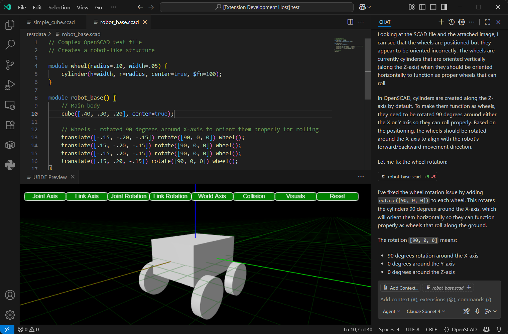

# OpenSCAD Preview and Language Support

OpenSCAD is a powerful tool for creating 3D models programmatically. This section covers how the URDF editor integrates OpenSCAD support, including file handling, previewing, and language features.



## OpenSCAD File Handling

The URDF editor can open and edit `.scad` files directly. When a `.scad` file is opened, the editor provides syntax highlighting and basic editing features.

## OpenSCAD Preview

The editor includes a preview feature for OpenSCAD files. When a `.scad` file is saved, the editor automatically converts it to STL format using the `openscad-wasm-prebuilt` module. The generated STL file is then displayed in the 3D viewer.

## OpenSCAD Language Features

The editor provides several language features for OpenSCAD:

- **Syntax Highlighting**: Basic syntax highlighting is available for OpenSCAD code.
- **Code Snippets**: Common OpenSCAD patterns are available as code snippets.
- **Error Reporting**: The editor reports syntax errors in OpenSCAD code.
- **OpenSCAD Library Support**: The editor recognizes and provides support for standard OpenSCAD libraries.

### OpenSCAD Library Configuration
The extension automatically loads OpenSCAD libraries from OS-specific default locations:
- **Windows**: `%USERPROFILE%\Documents\OpenSCAD\libraries`
- **Linux**: `$HOME/.local/share/OpenSCAD/libraries` 
- **macOS**: `$HOME/Documents/OpenSCAD/libraries`

To add custom library paths:
1. Open VS Code settings (`Ctrl+,`)
2. Search for "urdf-editor.OpenSCADLibraryPaths"
3. Add additional library directories (supports `${workspace}` variable)

Example settings.json:
```json
{
  "urdf-editor.OpenSCADLibraryPaths": [
    "${workspace}/scad_libs",
    "C:\\MyLibraries\\OpenSCAD",
    "/usr/local/share/openscad/libraries"
  ]
}
```

### OpenSCAD Documentation Generation
The extension can automatically generate documentation for your OpenSCAD libraries:

1. Open the command palette (`Ctrl+Shift+P`)
2. Run "URDF: Generate OpenSCAD Libraries Documentation"
3. Choose where to save the markdown file
4. The extension will scan all library paths and extract:
   - Header comments from library files
   - Module and function signatures
   - Parameter documentation
   - Usage examples

This documentation is also available to AI assistants via the Model Context Protocol (MCP) for intelligent code completion and suggestions.

## AI-Assisted Development Features

The URDF Editor provides advanced AI integration to enhance your OpenSCAD development workflow. These features leverage modern AI capabilities to make 3D modeling more intuitive and efficient.

### Visual Feedback Loop
- **Screenshot Integration**: The editor can automatically capture screenshots of your 3D models and provide them to AI assistants for visual analysis
- **Real-time Preview**: AI can see exactly what your OpenSCAD code produces, enabling contextual suggestions and corrections
- **Visual Debugging**: When your model doesn't look right, AI can analyze the rendered output and suggest code improvements

### Model Context Protocol (MCP) Integration
The editor includes a built-in MCP server that exposes powerful tools for AI assistants:

- **`take_screenshot`**: Captures high-quality screenshots of active OpenSCAD previews for AI analysis
- **`take_screenshot_by_filename`**: Takes targeted screenshots of specific files, automatically opening previews as needed
- **`get_openscad_libraries`**: Provides comprehensive documentation of available OpenSCAD libraries, modules, and functions

### AI-Powered Development Workflow
1. **Write or describe** your 3D model requirements in natural language
2. **Generate code** using AI assistance with full library context
3. **Preview instantly** with optimized fast rendering (preview mode)
4. **Get visual feedback** through automatic screenshot analysis
5. **Iterate rapidly** with AI suggestions based on rendered output

### Performance Optimizations for AI Workflow
- **Fast Preview Mode**: All OpenSCAD files render in optimized preview mode by default (10x faster)
- **Automatic Performance Settings**: Injected optimization settings (`$fn=8`, `$fa=12`, `$fs=2`) for quick iteration
- **Cancellable Operations**: Long-running renders can be interrupted instantly
- **1-minute Timeout**: Quick feedback prevents workflow interruption

This integrated approach enables a new style of "visual programming" where AI can understand both your code intent and the actual 3D output, creating a powerful feedback loop for rapid prototyping and design iteration.

## Acknowledgements

Special thanks to the OpenSCAD community for their work.

Thank you to [@lorenzowritescode](https://github.com/lorenzowritescode) for the the prebuilt OpenSCAD WASM module.
