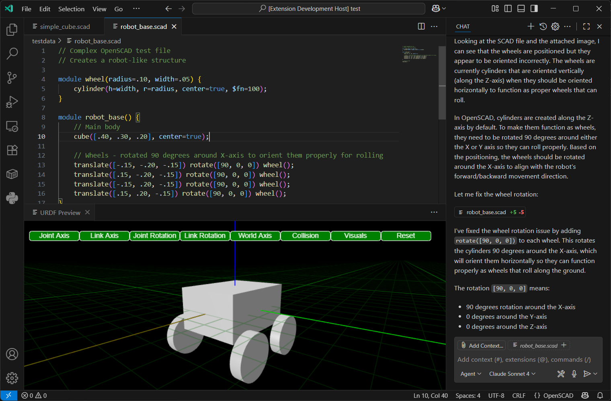
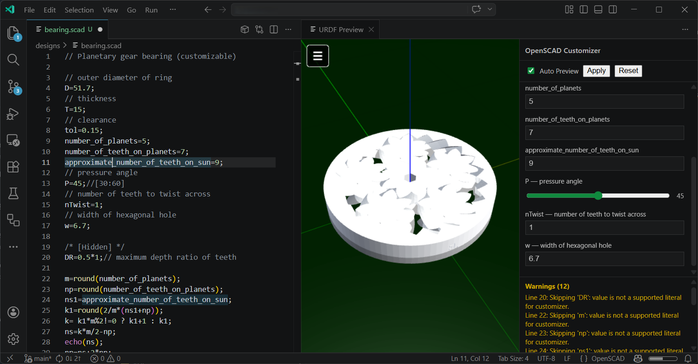

# OpenSCAD Preview and Language Support

OpenSCAD is a powerful tool for creating 3D models programmatically. This section covers how the URDF editor integrates OpenSCAD support, including file handling, previewing, and language features.



## OpenSCAD File Handling

The URDF editor can open and edit `.scad` files directly. When a `.scad` file is opened, the editor provides syntax highlighting and basic editing features.

## OpenSCAD Preview

The editor includes a preview feature for OpenSCAD files. When a `.scad` file is saved, the editor automatically converts it to STL format using the `openscad-wasm-prebuilt` module. The generated STL file is then displayed in the 3D viewer.

**Note**: STL format does not support colors or textures. OpenSCAD models are rendered as single-color geometry in the preview.

## SVG Export for 2D Designs

For 2D OpenSCAD designs, the editor supports exporting to SVG (Scalable Vector Graphics) format. This is particularly useful for creating vector graphics from OpenSCAD's 2D primitives like circles, squares, and polygons.

### How to Export to SVG

1. **From Explorer Context Menu**:
   - Right-click on any `.scad` file
   - Select "Export SVG" from the context menu
   - The SVG file will be created in the same directory with a `.svg` extension
   - You'll be prompted to open the exported file

2. **From Command Palette**:
   - Open a `.scad` file in the editor
   - Press `Ctrl+Shift+P` (or `Cmd+Shift+P` on Mac)
   - Type "Export SVG" and select "URDF: Export SVG"

### SVG Export Features

- **2D Shape Support**: Works with 2D OpenSCAD primitives (circle, square, polygon, text, etc.)
- **Vector Graphics**: Preserves scalability and crispness at any resolution
- **Library Support**: Includes all configured OpenSCAD libraries during export
- **Progress Indication**: Shows conversion progress with cancellation support
- **Error Handling**: Clear error messages if the export fails

**Note**: SVG export is designed for 2D designs. For 3D designs, use the existing STL export functionality (automatic on save/preview).

## OpenSCAD Language Features

The editor provides several language features for OpenSCAD:

- **Syntax Highlighting**: Basic syntax highlighting is available for OpenSCAD code.
- **Code Snippets**: Common OpenSCAD patterns are available as code snippets.
- **Error Reporting**: The editor reports syntax errors in OpenSCAD code.
- **OpenSCAD Library Support**: The editor recognizes and provides support for standard OpenSCAD libraries.

### OpenSCAD Library Configuration
The extension automatically loads OpenSCAD libraries from:
- **SCAD file directory**: The directory containing the SCAD file being previewed (highest priority). Only this directory and its subdirectories are loaded from the workspace.
- **OS-specific default paths**:
  - **Windows**: `%USERPROFILE%\Documents\OpenSCAD\libraries`
  - **Linux**: `$HOME/.local/share/OpenSCAD/libraries` 
  - **macOS**: `$HOME/Documents/OpenSCAD/libraries`

**Important Performance Notes**:
- The workspace root is **no longer automatically included** to avoid copying large directories like `.git`, `node_modules`, or virtual environments.
- Files in the same directory as the SCAD file can reference each other without any configuration.
- If your SCAD file is at the workspace root, all workspace files will be copied, which may cause rendering delays. Consider organizing SCAD files in a subdirectory for better performance.
- Certain directories are automatically excluded from copying: `.git`, `node_modules`, `venv`, `.venv`, `env`, `.env`, `__pycache__`, `.pytest_cache`, `.tox`, `dist`, `build`, `.cache`, `.vscode`, `.idea`, `target`, `bin`, `obj`

To add additional custom library paths:
1. Open VS Code settings (`Ctrl+,`)
2. Search for "urdf-editor.OpenSCADLibraryPaths"
3. Add additional library directories (supports `${workspaceFolder}` variable)

Example settings.json:
```json
{
  "urdf-editor.OpenSCADLibraryPaths": [
    "${workspaceFolder}/scad_libs",
    "C:\\MyLibraries\\OpenSCAD",
    "/usr/local/share/openscad/libraries"
  ]
}
```

### OpenSCAD Documentation Generation
The extension can automatically generate documentation for your OpenSCAD libraries:

1. Open the command palette (`Ctrl+Shift+P`)
2. Run "URDF: Generate OpenSCAD Libraries Documentation"
3. Choose where to save the markdown file
4. The extension will scan all library paths and extract:
   - Header comments from library files
   - Module and function signatures
   - Parameter documentation
   - Usage examples

This documentation is also available to AI assistants via the Model Context Protocol (MCP) for intelligent code completion and suggestions.

## AI-Assisted Development Features

The URDF Editor provides advanced AI integration to enhance your OpenSCAD development workflow. These features leverage modern AI capabilities to make 3D modeling more intuitive and efficient.

### Visual Feedback Loop
- **Screenshot Integration**: The editor can automatically capture screenshots of your 3D models and provide them to AI assistants for visual analysis
- **Real-time Preview**: AI can see exactly what your OpenSCAD code produces, enabling contextual suggestions and corrections
- **Visual Debugging**: When your model doesn't look right, AI can analyze the rendered output and suggest code improvements

### Model Context Protocol (MCP) Integration
The editor includes a built-in MCP server that exposes powerful tools for AI assistants:

- **`take_screenshot`**: Captures high-quality screenshots of active OpenSCAD previews for AI analysis
- **`take_screenshot_by_filename`**: Takes targeted screenshots of specific files, automatically opening previews as needed
- **`get_openscad_libraries`**: Provides comprehensive documentation of available OpenSCAD libraries, modules, and functions

### AI-Powered Development Workflow
1. **Write or describe** your 3D model requirements in natural language
2. **Generate code** using AI assistance with full library context
3. **Preview instantly** with optimized fast rendering (preview mode)
4. **Get visual feedback** through automatic screenshot analysis
5. **Iterate rapidly** with AI suggestions based on rendered output

### Performance Optimizations for AI Workflow
- **Fast Preview Mode**: All OpenSCAD files render in optimized preview mode by default (10x faster)
- **Automatic Performance Settings**: Injected optimization settings (`$fn=8`, `$fa=12`, `$fs=2`) for quick iteration
- **Cancellable Operations**: Long-running renders can be interrupted instantly
- **1-minute Timeout**: Quick feedback prevents workflow interruption

This integrated approach enables a new style of "visual programming" where AI can understand both your code intent and the actual 3D output, creating a powerful feedback loop for rapid prototyping and design iteration.

## OpenSCAD Customizer

The URDF Editor includes an OpenSCAD Customizer panel that lets you interactively adjust parameters in your `.scad` files without editing code directly.



### Enabling the Customizer

The Customizer panel appears automatically in the preview sidebar when a `.scad` file is open. Use the **Auto Preview** checkbox to toggle automatic re-rendering whenever a value changes, or use the **Apply** button to trigger rendering manually. **Reset** restores all values to their defaults from the source file.

### Defining Customizable Parameters

Parameters are parsed from top-level variable assignments in your `.scad` file. Follow the standard OpenSCAD Customizer conventions:

**Labels** — place a single-line comment immediately before the assignment to add a description:
```scad
// pressure angle
P = 45;
```

**Groups** — use a block comment of the form `/* [Group Name] */` to organize parameters into named sections:
```scad
/* [Slider] */
// slider widget for number
slider = 34; // [10:100]
```

**Sliders** — append an inline range comment `// [min:max]` to create a slider. Use `// [min:step:max]` for a stepped slider:
```scad
slider = 34;     // [10:100]
stepSlider = 2;  // [0:5:100]
```

**Dropdowns** — provide a comma-separated list of values to create a combo box. Works for both numbers and strings:
```scad
Numbers = 2;      // [0, 1, 2, 3]
Strings = "foo";  // [foo, bar, baz]
```

**Checkboxes** — boolean variables automatically render as a checkbox:
```scad
Variable = true;
```

**Textboxes** — string variables become a text input. Append `// [N]` to constrain the input length:
```scad
String = "length"; // [8]
```

**Vectors** — vector variables are supported and can include a range to constrain each component:
```scad
Vector3 = [12, 34, 46]; // [0:2:50]
```

**Hiding parameters** — variables declared inside a `/* [Hidden] */` section are excluded from the Customizer panel:
```scad
/* [Hidden] */
debugMode = true;
```

### Warnings

The Customizer panel displays a **Warnings** section listing any variables that were skipped. Common reasons include:
- The value is a computed expression (e.g. `m = round(number_of_planets)`)
- The literal type is not supported by the Customizer parser

Warnings do not affect rendering — skipped variables retain their values from the source file.

### Disabling the Customizer

To disable the Customizer panel globally, you can adjust the workspace or user setting:

1. Open VS Code settings (`Ctrl+,`)
2. Search for "OpenSCAD Customizer Enabled"
3. Uncheck the box or set `"urdf-editor.OpenSCADCustomizerEnabled": false`

When disabled, the Customizer panel will not appear even if customizer variables are detected in the `.scad` file.

## Acknowledgements

Special thanks to the OpenSCAD community for their work.

Thank you to [@lorenzowritescode](https://github.com/lorenzowritescode) for the the prebuilt OpenSCAD WASM module.
