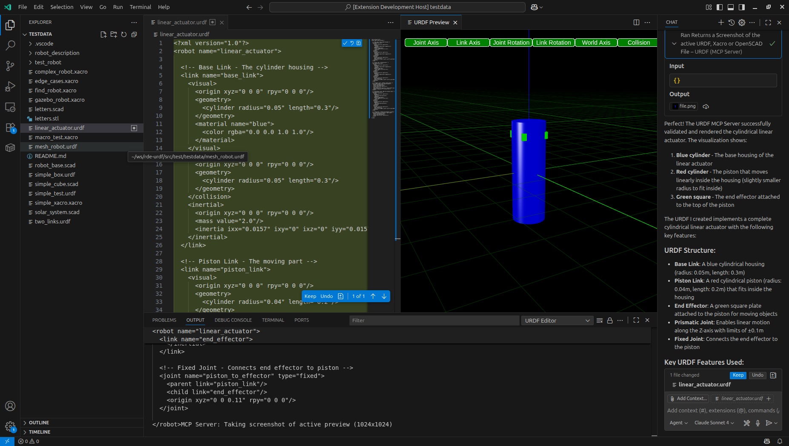

# Model Context Protocol Support
This extension implements a Model Context Protocol server which helps AI build URDF, Xacro and OpenSCAD models based on a high level description - by allowing it to check it's work visually when it makes modifications.

Before engaging with the AI, start a preview window by using the command palette (Ctrl+Shift+P) and selecting "URDF: Preview". This will open a new tab where the AI can send model updates to be rendered.

!

## Things to try

### Simple Robot Arm
Create a new file with a `.urdf` extension. (Ctrl+Shift+P) and selecting "URDF: Preview". Now open the AI Chat Window and enter the following prompt:

```Create a simple robot arm URDF model
The robot arm should have a base, a shoulder joint, an elbow joint, and a wrist joint
Each joint should have a range of motion
The robot arm should be able to reach out and pick up objects
The robot arm should be colored blue and white
Make sure to include appropriate links and joints between the parts
```

### OpenScad Solar System
Create a new file with a `.scad` extension. (Ctrl+Shift+P) and selecting "URDF: Preview". Now open the AI Chat Window and enter the following prompt:

```Create a simple solar system model in OpenSCAD. Since OpenSCAD is unitless, assume 1 unit = is 1mm for previewing, but internally scale such that 1 unit is 1 million kilometers.
The model should include the sun, earth, and moon
The sun should be a large yellow sphere
The earth should be a smaller blue and green sphere orbiting the sun
The moon should be a small gray sphere orbiting the earth
Make sure to include appropriate scaling and positioning for the celestial bodies
```

### Xacro Car
Create a new file with a `.xacro` extension. (Ctrl+Shift+P) and selecting "URDF: Preview". Now open the AI Chat Window and enter the following prompt: 

```Create a simple car model in Xacro
The car should have a body, four wheels, and a steering mechanism
The car body should be red with black windows
The wheels should be black with silver rims
Make sure to include appropriate links and joints between the parts
```

## Notes
- The MCP server currently supports URDF, Xacro, and OpenSCAD file formats.
- The AI may need to iterate on the model multiple times to get it right. Feel free to ask it to make changes or fix issues.
- The preview window will automatically update whenever the AI sends a new model.
- If the AI generates invalid syntax, it may not be able to render the model. In this case, ask the AI to fix the syntax errors.
- The MCP server is a powerful tool, but it may not always produce perfect results. Use it as a starting point and refine the models as needed.
- The MCP server is still under development, so expect some rough edges. Feedback is welcome!

